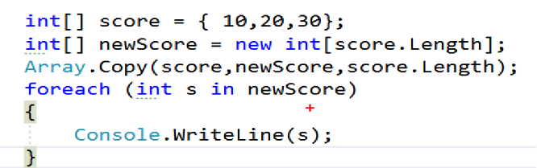
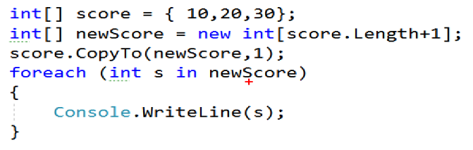
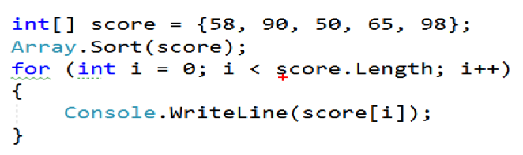
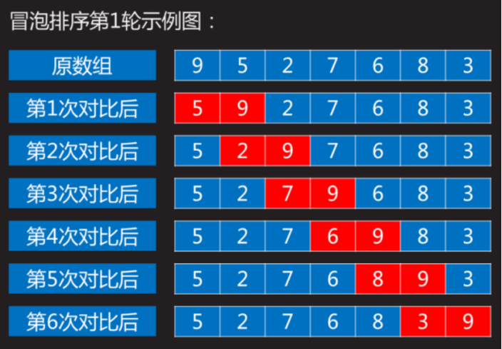
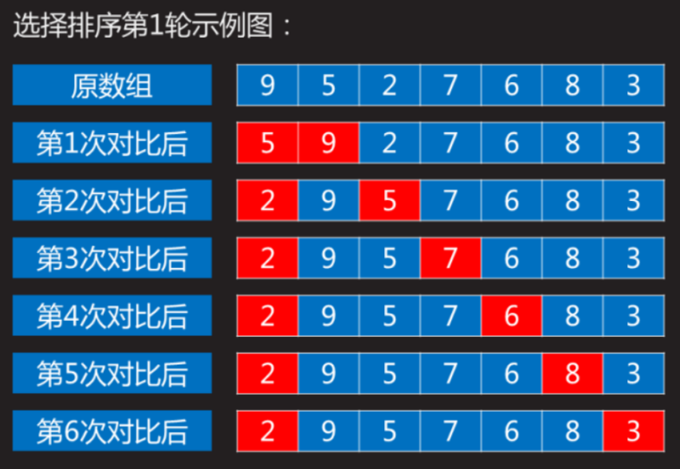
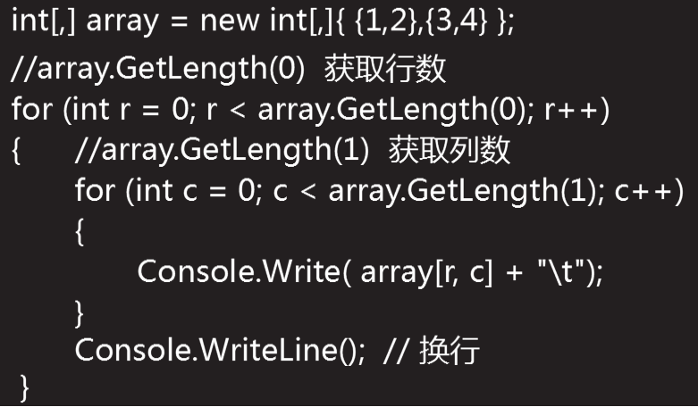

## 数组

**定义：**数组是内存中一块连续区域，用于存放多个相同类型的数据。数组中的每个数据使用相同的数组名，但是使用不同的唯一标识。

#### 数组的定义

1.定义数组：

```
float[]  scores ; 
```

2.数组初始化

- 静态初始化　

  数据类型[]  数组名  =  { 值1 , 值2，....值n }

  ```
  float[]  scores = { 60.5f,  80.5f, 70.0f, 65.5f, 90.0f } ; 
  ```

  

- 动态初始化

  ```
  　int[]   ages   =   new  int[5] { 20 , 22 , 24 , 26 , 30 } ;
  ```

  错误的写法：大括号中有4个元素，但中括号中定义时长度是5，两处不一致，所以不正确。

  ```
  int[] ages = new int[5] { 20 , 22 , 24 , 26 } ; 
  ```

#### 数组的操作

1.获取长度

```
scores.Length
```

2.数组的遍历

```
 int[]  ages  =  { 20, 21, 22, 25 } ; 
 for ( int  i = 0 ;  i < ages.Length ;  i++ )
 {
	Console.WriteLine (  ages[i] ) ; 
 }
```

3.foreach

```
foreach 是一种更简单更明了的读取数组元素的语句。
特点：
    --用于读取容器类数据（数组、集合等）
    -- 适合一次性读取全部元素
    --不能修改元素
    
 基本语法：
 	foreach(  数据类型   变量名   in    数组名) 
    {
   	    变量名此时表示的就是数组中的每一个元素 
   	}
```


4,数组的长度

```
 最后一个元素的下标为：
　　　　数组长度 - 1 ，即：数组名.Length - 1 
```


## Array

Arrays 类提供了一系列快速操作数组的方法，如：排序、反转等操作，

- [ ] 复制数组元素：Array.Copy ( )   数组名.CopyOf( )
- [ ] 清除数组元素：Array.Clear( )
- [ ] 反转数组元素：Array.Reverse( )
- [ ] 数组元素排序：Array.Sort( )
- [ ] 克隆数组元素：Array.Clone( )
- [ ] 查找数组元素：Array.IndexOf( )

#### 数组复制

1.Array.copy(原，目标，数组长度);





#### 数组排序

1.数组排序：数值型数组排序时，默认按照数字从小到大升序排序



2.排序算法

- 冒泡

  

  

- 选择排序

  ​	

  


## 二维数组

```
string[,] array01 = new  string[3,2];
```

-    -- 初始化 + 赋值

  ```
  int[,] array02 = new int[,]{ {1,2},{3,4} };
  ```

  

- 二维数组取值

  ​	