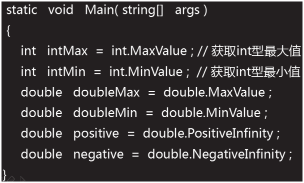
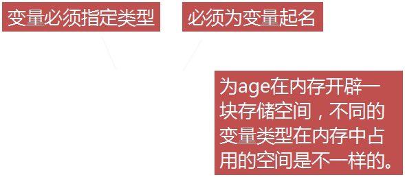
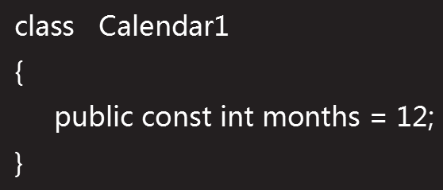
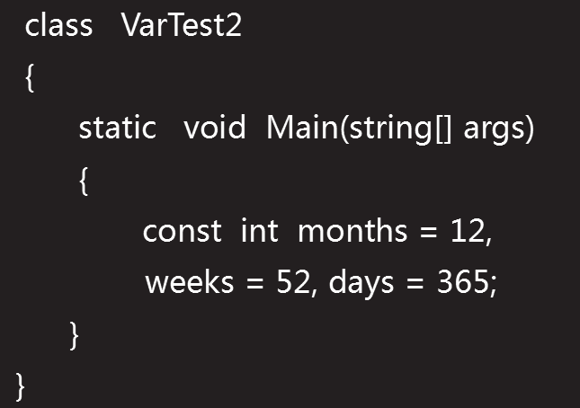
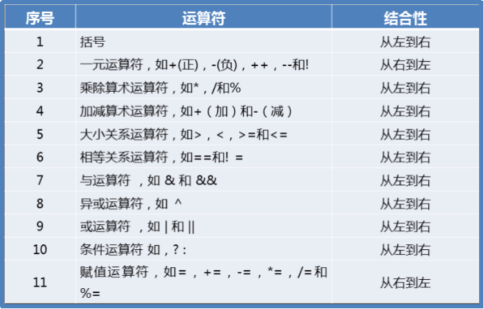

# 语言基础

**目标**

- [x] 基本数据类型
- [x] 数据类型转换
- [x] string数据类型

#### 基本数据类型

- 数据类型分为两大类：值类型和引用类型。

  - 值类型：所谓值类型，是**以“栈”的形式存储的**，它将数据的地址，也可以认为是数据和命名放在一起的；
  - 引用类型：引用类型，是以“堆”的形式存储数据的，但它并未抛弃栈，它将数据的地址存储在栈中，而数据具体内容存储在堆中，然后将栈中的数据名用一个指针指向堆中它相应的内容，如此一来，它就将数据和内容分开存储了。

  **简单说：值即使直接存储数值   引用类型就是存储地址**

  #### 值类型

  -  分类：

    - 结构:包括了13种基本数据类型:

      | 类型   | 占据空间 |                                          |
      | ------ | -------- | ---------------------------------------- |
      | byte   | 1 Byte   |                                          |
      | sbyte  | 1 Byte   |                                          |
      | short  | 2 Byte   |                                          |
      | ushort | 2 Byte   |                                          |
      | int    | 4 Byte   | 开辟 4 个字节的空间,范围：-2^31 ~ 2^31-1 |
      | uint   | 4 Byte   |                                          |
      | long   | 8 Byte   |                                          |
      | ulong  | 8 Byte   |                                          |
      | float  | 4 Byte   | 开辟4个字节                              |

      - int数据类型
        - int所能表示的数据范围，会出现错误。
        - 如果一个整数是int、uint、long或是ulong没有任何显式的声明，则该变量默认为int类型。若要指定其他整数 类型，可在数字后面加类型的缩略表示
        - 运算：两个整数相除，如果结果是小数，会自动舍弃小数，只取整数部分（直接舍弃小数，不四舍五入）
        - 溢出：两个整数进行运算时，结果可能会超过整数范围，　造成数据溢出的情况。
      - float数据类型
        - float 一般用于表示较小的浮点数，且精度较低；
        - 一个float类型的数据，在内存占用 4 个字节；
        - 浮点数默认的直接量（字节量）是 double 双精度类型，所以使用float 定义一个浮点数时，需要在具体数字后面加上float的表示符f，（大小写均可）   float  height  =  1.75f ；
      - double类型
        - double类型，称为双精度小数
        - 使用double类型描述小数时，小数后面省略了大写或小写的字母　D　
        - C#中的double类型，运算时数据不准确，原因：**底层处理的都是二进制数据。在二进制系统中，只能使用0和1，故二进制中是无法精确的表示1/10(十分之一)**，一般不会使用=double 或 float　来进行一些精确数据运算的场合或行业，如：银行系统，工程图纸等方面。
      - bool类型
        - bool 值不能和整数值进行相互转换；
        - bool 类型的默认值为：false 

      **数值的最大值和最小值**

      

      **值类型的字节数：sizeof ( 类型说明符 )  **

    - 枚举:

  ### 引用类型:

  - object、string,存储在堆栈中，且存储的是在堆内存     中的引用（地址）

  

#### 数据类型转换

1. 数据类型转换的方式：自动类型转换（又叫：隐式类型转换　或　向上转型）强制类型转换（又叫：显示类型转换　或　向下转型）
   - 自动类型转换：安全方式进行的转换, **不会导致数据丢失。**
   - 显示类型转换：将一个范围大的数据转为一个范围小的数据类型。
     - 有可能引起数据溢出或精度丧失

#### String数据类型

1.字符串（string）类型 允许您给变量分配任何字符串值，字符串（string）类型是 System.String 类的别名。它是从对象（Object）类型派生的。

2.定义的时候使用双引号括起来

#### 变量

1.在内存中开辟的一块存储空间，用于存储程序中需要的各种类型的数据。

2.访问修饰符，如果省略默认为private。

3.变量可以被多次赋值，变量的值则是最后一次的赋值 .

4.常量:常量在声明时必须初始化赋值

​	

一次可以声明多个常量

6.常量分类：常量可以是任何基本数据类型，比如整数常量、浮点常量字符常量或者字符串常量，还有枚举常量。

- 整数常量可以是十进制八进制、十六进制。
- 整数常量也可以有后缀，可以是 U 和 L 的组合，U 和 L 分别表示 unsigned 和 long。后缀可以是大写或者小写，多个后缀以任意顺序进行组合

7.运算符优先级

#### 控制台输入

- ReadLine()：用于从标准的输入流读取一行内容，返回string。标准输入设备为键盘时，ReadLine()表示读取用户从键盘输入内容，此方法会造成程序阻塞，直到用户按下Enter 键时停止。
- ReadLine方法另外用途是在清空控制台并向其显示新信息之前暂停程序执行，或者提示用户在终止应用程序之前按下Enter键。

