# PS基本操作

1. 画布操作

   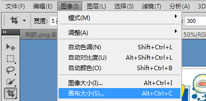

   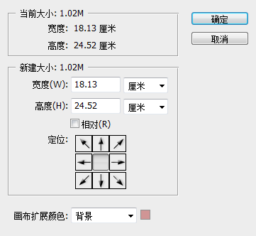

2. 旋转

   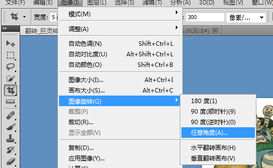

3. 旋转画布

   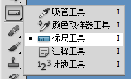

   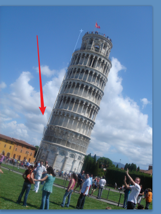

   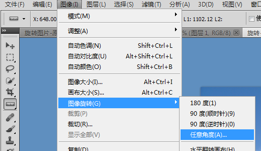

   

4. 一般裁剪

   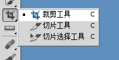

   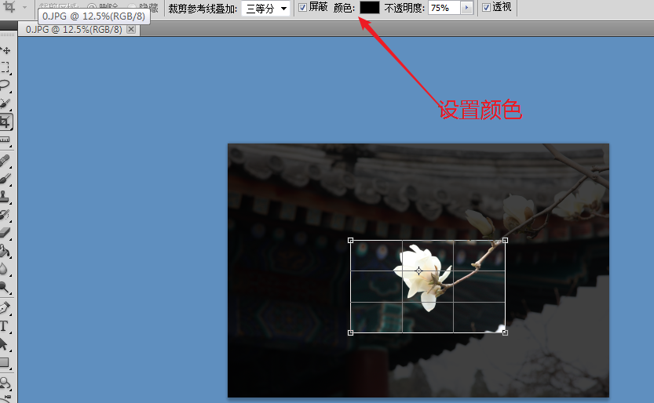

5. 透视裁剪

   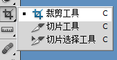

   选中上方的透视

   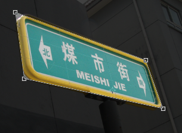

6. 照片的处理，

   设置图片的大小，然后设置边框，将其放入到一个布局里面。

   

   裁剪之后，设置画布

   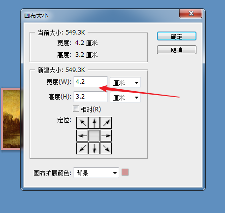

   制作图片

   

   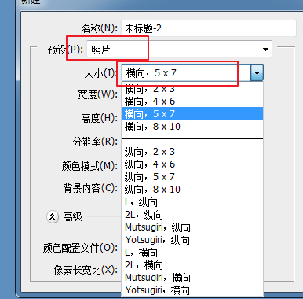

   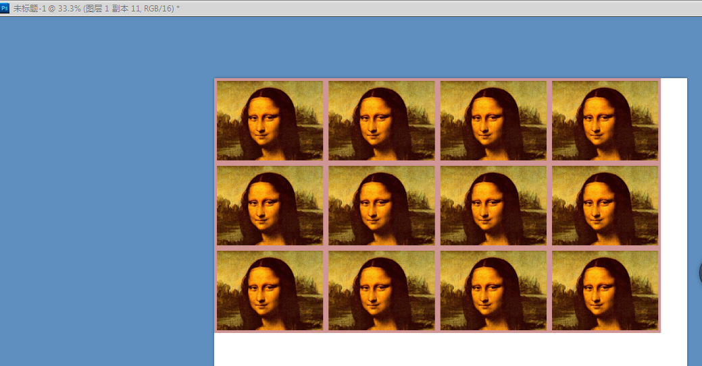

   按住ALT进行复制

7. 拼合

   先将画布变大，然后将需要拼接的连接在一起，然后将一个的透明度调低，进行-拼合，最后进行裁剪就可以了。

   拼接之后，会出现这样的效果，如何处理

   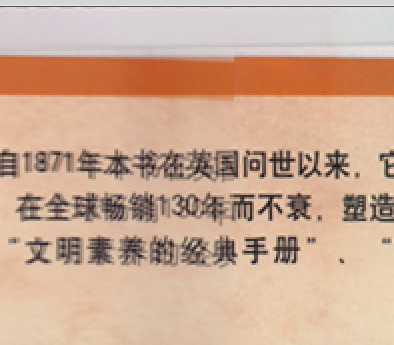

   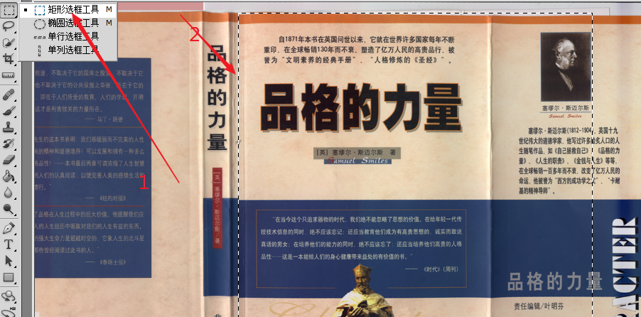按下delete就可以了。

   拼接的时候ctrl+t进行旋转等，如果图片无法移动，可以修改他们的模式。

   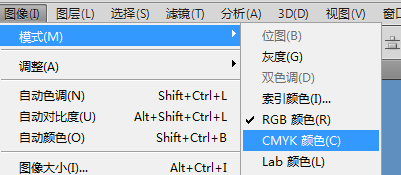

8. 选区

   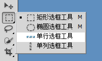

   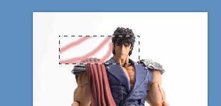

   当选中的时候，只能在选中的区域中修改和画图。选取就是将要操作的区域。

   案例实现下面这样的效果

   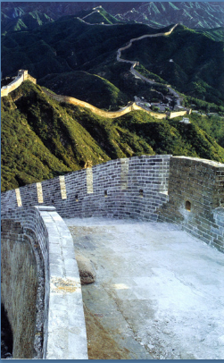

   第一步设置选取

   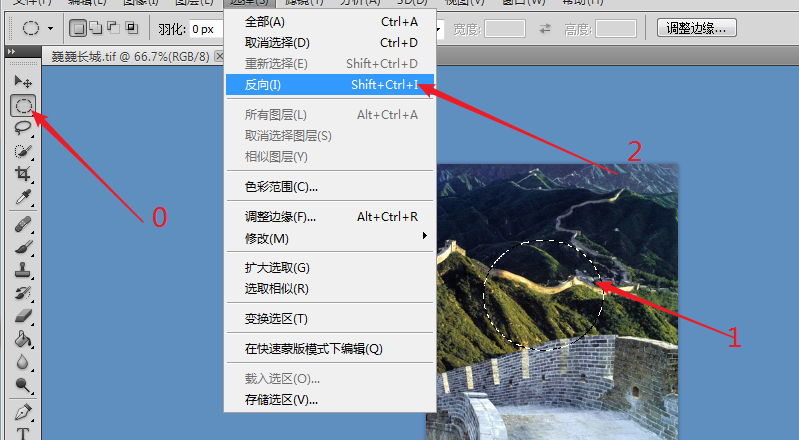

   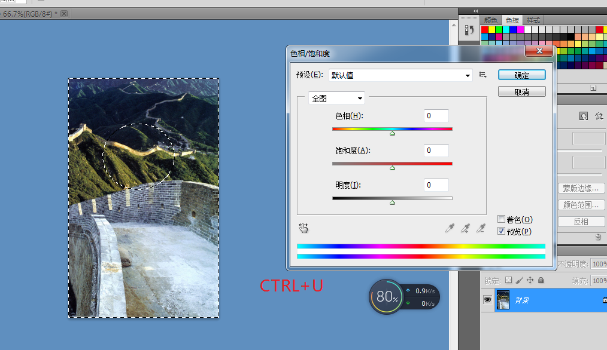

   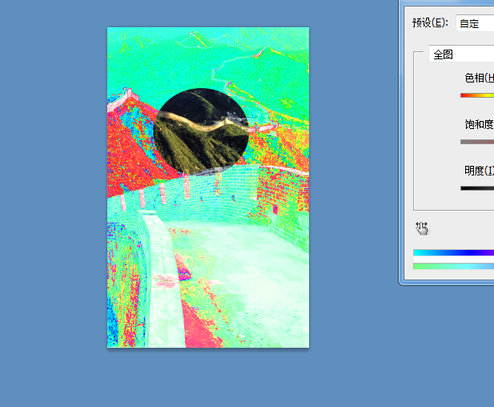

   ---------

   复制粘贴

   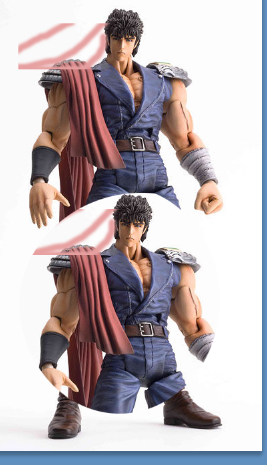

   选中，ctrl  C  ctrl  V   

   去除logo：

   复制图层，覆盖它， ctrl  C  ctrl  V  或者是ALT移动 [原图层修改]  

   ctrl+T进行其他变换。

9. 选区运算

   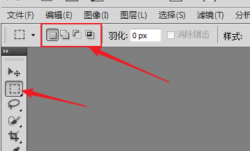

   一个选区   两个选区合并  两个选区相减   两个选区公共

10. 

